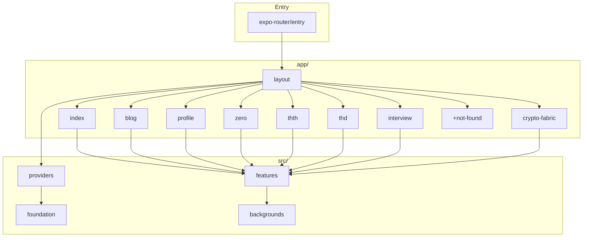

# Vite to React Native / Expo Migration Plan

## Current State Summary

- **Dual structure**: Vite (`main.tsx` + `react-router-dom`) is the active entry; `app/` has partial Expo Router routes (home, blog, crypto-fabric, +not-found) but is not the primary build.
- **Already RN-ready**: `src/foundation`, `src/providers`, `src/features/home`, `blog`, `cryptofabric` screens use React Native primitives and StyleSheet.
- **DOM-heavy pages**: `MainPage`, `FullProfile`, `Thd`, `Thth`, `CryptoFabric` (page), `Interview` 1/2/3, `ZeroTruth` use `div`, `a`, `className`, `framer-motion`, `window`/`document`, and Three.js backgrounds.
- **Configs**: `app.json` exists with expo-router; `babel.config.js` has expo preset; no `metro.config.js`; no `eas.json`.

---

## Phase 1: Config and Tooling Migration

### 1.1 Remove Vite, Add Expo/Metro

**Remove**

- `vite.config.ts`, `src/vite-env.d.ts`, `index.html`
- Dependencies: `vite`, `@vitejs/plugin-react`, `react-dom`, `react-router-dom`, `rollup-plugin-visualizer`, `eslint-plugin-react-refresh`
- Scripts: `prerender.ts` (Puppeteer-based; replace with Expo static export)

**Add**

- `expo`, `expo-router`, `expo-status-bar`, `expo-constants`, `expo-linking`, `expo-splash-screen`
- `react-native`, `react-native-web`, `react-native-safe-area-context`
- `metro.config.js` (Expo default)

**Update [package.json](package.json)**

- `"main": "expo-router/entry"`
- Scripts: `"start": "expo start"`, `"web": "expo start --web"`, `"build": "expo export:web"`, `"build:prebuild": "expo prebuild"`
- Remove Vite-related scripts

### 1.2 TypeScript and Babel

**Update [tsconfig.json](tsconfig.json) / [tsconfig.app.json**](tsconfig.app.json)

- Change `"lib": ["ES2020", "DOM", "DOM.Iterable"]` to `"lib": ["ES2020"]` (or keep DOM only for web typings if needed)
- `"moduleResolution": "bundler"` remains; ensure `"jsx": "react-jsx"`
- Include `app/` and `src/` in `include`

**Update [babel.config.js](babel.config.js)**

- Keep `babel-preset-expo`; remove `@babel/preset-react` if redundant with expo preset
- Add `expo-router/babel` if required by expo-router

### 1.3 Tailwind and Styling

- **Option A**: Remove Tailwind; migrate remaining `className` usage to `StyleSheet` (aligns with existing screens).
- **Option B**: Add NativeWind for RN-compatible Tailwind (more setup).

**Recommendation**: Remove Tailwind; the Expo screens already use StyleSheet. Migrate DOM pages to StyleSheet as part of component conversion.

### 1.4 EAS and Deployment

- Add `eas.json` for EAS Build (iOS/Android) and `eas update` if desired.
- Update [deploy.sh](deploy.sh): `expo export:web` outputs to `dist/`; Netlify can continue deploying `dist/`.

---

## Phase 2: Entry Point and Routing

### 2.1 Single Entry

- Delete [src/main.tsx](src/main.tsx) (Vite entry).
- Expo Router uses `app/_layout.tsx` as root; entry is `expo-router/entry` per package.json.

### 2.2 Complete app/ Route Map

| Current Vite Route | New app/ Route            | Source                                                                  |
| ------------------ | ------------------------- | ----------------------------------------------------------------------- |
| `/`                | `app/index.tsx`           | HomeScreen (exists)                                                     |
| `/blog`            | `app/blog/index.tsx`      | BlogListScreen (exists)                                                 |
| `/blog/:id`        | `app/blog/[id].tsx`       | BlogArticleScreen (exists)                                              |
| `/cryptofabric`    | `app/crypto-fabric.tsx`   | CryptoFabricScreen (fix import path: `cryptofabric` not `cryptoFabric`) |
| `/profile`         | `app/profile.tsx`         | New ProfileScreen (from FullProfile)                                    |
| `/zero`            | `app/zero.tsx`            | New ZeroScreen (from ZeroTruth)                                         |
| `/thth`            | `app/thth.tsx`            | New ThthScreen (from Thth page)                                         |
| `/thd`             | `app/thd.tsx`             | New ThdScreen (from Thd page)                                           |
| `/interview`       | `app/interview/index.tsx` | Interview index                                                         |
| `/interview/1`     | `app/interview/1.tsx`     | Interview 1                                                             |
| `/interview/2`     | `app/interview/2.tsx`     | Interview 2                                                             |
| `/interview/3`     | `app/interview/3.tsx`     | Interview 3                                                             |
| 404                | `app/+not-found.tsx`      | Exists                                                                  |

---

## Phase 3: Component Migration (DOM to RN)

### 3.1 Shared Layout and Navigation

- **[MainNav](src/layout/MainNav.tsx)**: Replace `div`, `a`, `document.getElementById`, `window.scrollTo` with `View`, `Pressable`, `Link`, `useRouter`, `ScrollView` refs. Use `useWindowDimensions` or `Dimensions` instead of `window.innerWidth`.
- **[ContactFooter](src/layout/ContactFooter.tsx)**: Replace `a` with `Pressable` + `Linking.openURL`.
- **[CookieNotice](src/layout/CookieNotice.tsx)**: Replace DOM with RN primitives; use `AsyncStorage` or `expo-secure-store` for consent.
- **[CopyrightNotice](App.tsx)**: Move to layout; use `View`, `Text`, `Linking`.

### 3.2 Page-to-Screen Conversions

Convert each Vite page to an Expo screen using `View`, `Text`, `ScrollView`, `Image`, `Pressable`, `Linking`:

| Page                    | Key Changes                                                                                                                                                                   |
| ----------------------- | ----------------------------------------------------------------------------------------------------------------------------------------------------------------------------- |
| **MainPage**            | Replace `motion.div`, `div`, `iframe` (SoundOn) with `View`; use `WebView` for SoundOn embed; replace `window`/`document` scroll logic with `ScrollView` refs and `scrollTo`. |
| **FullProfile**         | Replace `motion.div`, `img`, `a` with `View`, `Image`, `Pressable`+`Linking`; migrate `Seo` to platform-safe (web-only) or `expo-head`.                                       |
| **Thd**                 | Replace DOM + AnimatedBackground with RN layout; use `BackgroundFallback` on native.                                                                                          |
| **Thth**                | Same pattern.                                                                                                                                                                 |
| **CryptoFabric** (page) | Already have CryptoFabricScreen; remove duplicate page, use screen.                                                                                                           |
| **ZeroTruth**           | Replace DOM layout; use `NebulaStormBackground` web-only wrapper.                                                                                                             |
| **Interview 1/2/3**     | Replace DOM + AnimatedBackground; use fallback on native.                                                                                                                     |

### 3.3 Backgrounds (Web-Only)

- Create `src/backgrounds/BackgroundWithFallback.tsx`:
  - Use `Platform.OS === 'web'` to render `AnimatedBackground` or `NebulaStormBackground`.
  - On native, render a `View` with gradient (e.g. `expo-linear-gradient`) or solid color.
- Update all screens that use backgrounds to use `BackgroundWithFallback`.

### 3.4 DOM/Web API Replacements

| DOM/Web API                            | RN Replacement                                   |
| -------------------------------------- | ------------------------------------------------ |
| `document.title`                       | `expo-head` (web) or no-op on native             |
| `document.cookie`                      | `AsyncStorage` or `expo-secure-store`            |
| `window.scrollTo`                      | `ScrollView.scrollTo`                            |
| `window.location`, `window.innerWidth` | `useWindowDimensions`, `Linking`                 |
| `document.getElementById`              | `ref` on `ScrollView`/`View`                     |
| `window.speechSynthesis`               | Guard with `Platform.OS === 'web'` or use RN TTS |
| `document.execCommand('copy')`         | `expo-clipboard`                                 |
| `a href`                               | `Pressable` + `Linking.openURL` or `Link`        |
| `iframe`                               | `WebView` from `react-native-webview`            |

### 3.5 SEO and Meta (Web)

- **[Seo](src/foundation/seo/Seo.tsx)**: Uses `document.head`, `document.title`. Wrap in `Platform.OS === 'web'` guard or migrate to `expo-head` for web export.
- Prerender: Expo static export does not run Puppeteer. Use `expo export:web`; for SEO, ensure meta tags are in HTML template or use `expo-head` / similar.

---

## Phase 4: Phantom Connect Integration

Per [setup-react-native-app SKILL](.cursor/plugins/cache/cursor-public/phantom-connect/ce44e177836416c08470fb3f49f84c53b244710f/skills/setup-react-native-app/SKILL.md):

1. **Install**: `npx expo install @phantom/react-native-sdk react-native-get-random-values @expo/browser expo-web-browser expo-crypto`
2. **Polyfill**: Add `import "react-native-get-random-values"` as first import in entry (e.g. `app/_layout.tsx` or a root `index.js`).
3. **app.json**: Add `scheme`, `plugins: ["expo-web-browser"]`.
4. **PhantomProvider**: Wrap app in `PhantomProvider` with `appId`, `providers`, `addressTypes`, `scheme`, `redirectUrl`.
5. **Hooks**: Use `useConnect`, `useAccounts`, `useDisconnect`, `useSolana` where wallet UI is needed (e.g. a dedicated wallet/connect screen or header).

---

## Phase 5: Cleanup and Scripts

- Delete `scripts/prerender.ts`, `scripts/prerender-routes.ts` (or adapt for future static generation if needed).
- Update `scripts/pre-deploy-check.cjs` to run `expo export:web` instead of Vite build.
- Update [deploy.sh](deploy.sh): `yarn build` runs `expo export:web`; output remains `dist/` for Netlify.
- Remove `index.html`; Expo web uses its own HTML template.
- Move `index.html` meta/SEO content into `app.json` or a custom web template if Expo supports it.

---

## Phase 6: Testing and Validation

- Run `yarn start` (Expo dev), `yarn web` (web dev), `expo export:web` (production build).
- Run `yarn typecheck`.
- Manually verify: home, blog, profile, zero, thth, thd, interview, crypto-fabric, 404.
- Test Phantom Connect flow on dev client (deep links require physical device or Expo Dev Client).

---

## File Change Summary

| Action | Files                                                                                                                                                                                                                                         |
| ------ | --------------------------------------------------------------------------------------------------------------------------------------------------------------------------------------------------------------------------------------------- |
| Delete | `vite.config.ts`, `src/vite-env.d.ts`, `src/main.tsx`, `index.html`, `scripts/prerender.ts`, `scripts/prerender-routes.ts`                                                                                                                    |
| Create | `metro.config.js`, `eas.json`, `app/profile.tsx`, `app/zero.tsx`, `app/thth.tsx`, `app/thd.tsx`, `app/interview/index.tsx`, `app/interview/1.tsx`, `app/interview/2.tsx`, `app/interview/3.tsx`, `src/backgrounds/BackgroundWithFallback.tsx` |
| Modify | `package.json`, `tsconfig.json`, `tsconfig.app.json`, `babel.config.js`, `app.json`, `deploy.sh`, `app/_layout.tsx` (Phantom), `app/crypto-fabric.tsx` (import path), all DOM pages and layout components                                     |

---

## Architecture After Migration

---

## Risks and Mitigations

- **Three.js on native**: Using web-only backgrounds with fallback avoids expo-gl complexity on mobile.
- **SEO**: Expo static export may not prerender; verify meta tags in built HTML. Consider `expo-head` or a custom web index.
- **Cookie/Storage**: `cookieService` must be replaced with RN-compatible storage for cookie notice.
- **Phantom deep links**: Require Expo Dev Client or physical device; document for developers.

